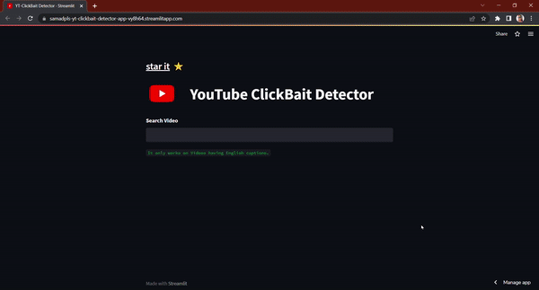

 

+ Youtube click-bait detector is a web application that suggests top recommended videos based on passing a machine learning test.
## Demo
  

### How does it work?

- It works by checking each video title and sub-titles and then suggests the selected videos which have no conflict in their title and video.

### How to use it?
 - By clicking the above link, you will redirect to the web app. Search any topic and wait for the magic. 
### Note:
`Don't exploit it by searching for unnecessary things. As it works on only English captions videos.`

**Make sure to star it and follow me for more🤍**
